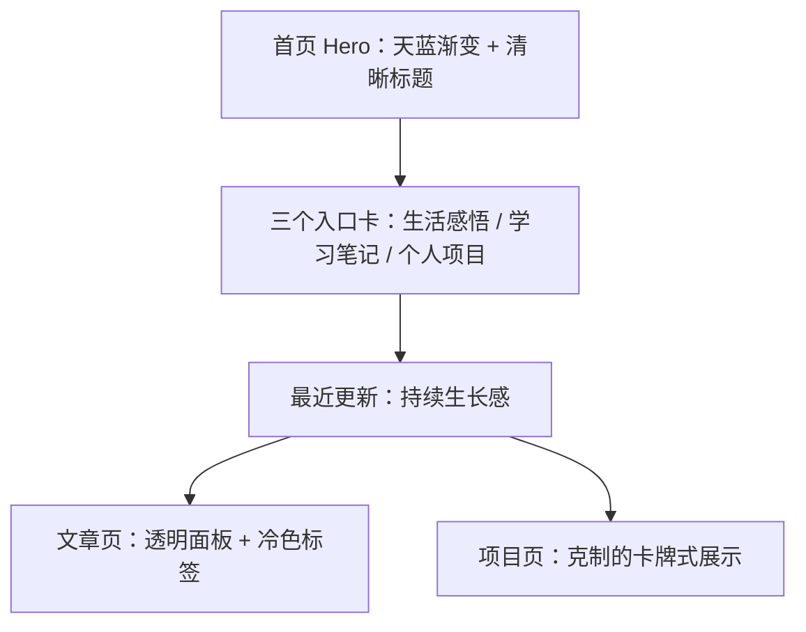

# P3R 白天模式规划

## 参考目标

参考《Persona 3 Reload》的官网与视觉气质，提炼出“清透蓝色、现代感、情绪克制但有冲击力”的白天模式。

官方页面明确提到它是“modern era”的重制版，并强调“signature stylish UI”和“emotional, gripping journey”。我这里的理解是：它的美术不是花哨，而是用干净的蓝、冷白、精确的层级与透明叠层，去表现一种清醒、安静、带一点忧郁的青春感。

参考链接：
- [Persona 3 Reload Official Website](https://persona.atlus.com/p3r/?lang=en)
- [Persona | Official Website](https://persona.atlus.com/series/portal/us/)

## 风格关键词

- 天蓝色
- 透明叠层
- 轻盈留白
- 冷静、清澈、克制
- 现代 UI 感
- 情绪化但不喧闹

## 视觉提炼

| 维度 | 规划 |
| --- | --- |
| 主色 | 天蓝、冰蓝、雾白 |
| 辅色 | 深海军蓝、浅灰蓝、少量银白 |
| 背景 | 大面积浅蓝渐变，叠一层轻微噪点或雾感纹理 |
| 卡片 | 半透明、细边框、圆角偏大 |
| 文字 | 深蓝黑，标题更粗，正文更柔和 |
| 装饰 | 细线、短横、轻微斜切、很少量的高光 |
| 动效 | 缓慢、柔和、像“呼吸感”一样的进入动画 |

## 网站映射

### 首页

- 首页只保留简介、三个板块入口、最近更新。
- Hero 用大面积天蓝渐变，像“清晨天空”。
- 三个入口做成轻盈玻璃卡片，每张卡片有独立色块和短标签。
- 最近更新做成纵向列表，强调“持续生长”，不要做成花哨展板。

### 文章页

- 文章标题要有更强的呼吸空间。
- 标题下方用细线 + 标签胶囊，像 P3R 的现代 UI 面板。
- 文章正文保持高可读性，少用强烈装饰。

### 项目页

- 项目卡片更适合偏“卡牌式”的结构。
- 重点是清楚展示目标、角色、技术取舍，而不是堆技术名词。

## 组件建议

- 顶部导航：半透明、细边框、轻微模糊。
- 首页入口卡：圆角、浅阴影、蓝色渐变标题条。
- 最近更新卡：左侧用细竖线或小色块区分分类。
- 标签：冷色胶囊，默认不高饱和。
- 按钮：主按钮用蓝底白字，次按钮用白底蓝边。

## 推荐 CSS 变量

```css
:root[data-theme='day'] {
  --color-bg: #eaf7ff;
  --color-bg-soft: #f8fcff;
  --color-surface: rgba(255, 255, 255, 0.72);
  --color-ink: #12263a;
  --color-muted: #55708a;
  --color-accent: #4ba8ff;
  --color-accent-2: #8edcff;
  --color-border: rgba(75, 168, 255, 0.22);
  --shadow-card: 0 18px 40px rgba(42, 88, 120, 0.12);
}
```

## Mermaid 结构图



## 设计边界

- 不直接复制 Persona 角色、图标、字体资产。
- 不把页面做成“游戏 UI 皮肤”，只借用其色彩与层级逻辑。
- 视觉优先，但可读性必须先于装饰性。
- 所有动效都要支持 `prefers-reduced-motion`。

## 下一步如果落地

1. 先建立 `day` 主题 token。
2. 再把首页、导航、文章卡片、项目卡片换成同一套视觉语法。
3. 最后再调动效和背景纹理。
