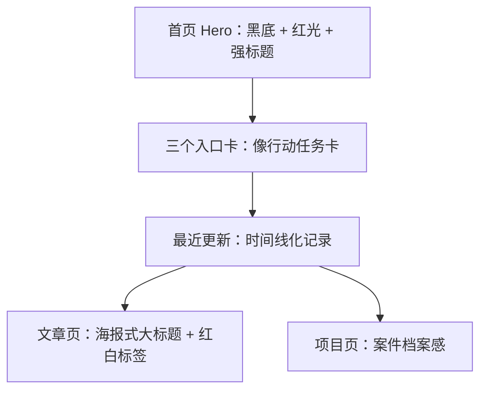

# P5R 黑夜模式规划

## 参考目标

参考《Persona 5 Royal》的美术气质，提炼出“红黑高对比、海报感、锋利、叛逆、戏剧化”的黑夜模式。

P5R 的视觉核心不是单纯的红色，而是“黑底 + 猩红 + 白字 + 斜切排版 + 海报式冲击力”。它让界面像一张不断被撕贴、重组的行动宣言，而不是规整的网页。

参考链接：
- [Persona 5 Royal Official Website](https://persona.atlus.com/p5r/?lang=en)
- [Persona | Official Website](https://persona.atlus.com/series/portal/us/)

## 风格关键词

- 红黑高对比
- 海报感
- 斜切、撕裂、贴纸
- 强节奏、强态度
- 戏剧化但仍可读
- 夜行、潜入、宣言感

## 视觉提炼

| 维度 | 规划 |
| --- | --- |
| 主色 | 黑、炭灰、猩红 |
| 辅色 | 乳白、暗红、少量亮红 |
| 背景 | 深黑渐变 + 颗粒噪点 + 少量红色光晕 |
| 卡片 | 更硬朗，边角可做切角或斜切 |
| 文字 | 大标题更夸张，标签更像贴纸 |
| 装饰 | 撕纸边、斜杠、强调线、红色胶带感 |
| 动效 | 更快、更干脆，进入时有明显位移和压迫感 |

## 网站映射

### 首页

- 首页依然保持“简介 + 三个入口 + 最近更新”的结构，但整体语气更像夜间行动面板。
- Hero 用黑底红光，标题加大并拉开字距。
- 三个入口卡像三张任务卡，边缘更锋利，hover 时更像“翻页/撕开”。
- 最近更新变成高对比时间线，像行动记录。

### 文章页

- 文章标题像海报标题，字号更大，允许更强的视觉断点。
- 章节标题可带红色横条或斜切标识。
- 引用、提示、标签用更明确的红白对比。

### 项目页

- 项目应该像“案件档案”或“行动记录”。
- 强调目标、策略、取舍、结果，视觉上更像任务简报。

## 组件建议

- 顶部导航：黑底、细红边、当前项用红色高亮。
- 首页入口卡：更像贴纸或任务卡，允许轻微倾斜。
- 最近更新卡：左侧红条，日期信息最先被看到。
- 标签：红底白字或黑底红边。
- 按钮：主按钮黑底红字，次按钮透明底红边。

## 推荐 CSS 变量

```css
:root[data-theme='night'] {
  --color-bg: #09090d;
  --color-bg-soft: #111117;
  --color-surface: rgba(20, 20, 28, 0.9);
  --color-ink: #f6f1ea;
  --color-muted: #b8b0a6;
  --color-accent: #e51d2b;
  --color-accent-2: #ff4e59;
  --color-border: rgba(255, 255, 255, 0.08);
  --shadow-card: 0 22px 55px rgba(0, 0, 0, 0.42);
}
```

## Mermaid 结构图



## 设计边界

- 不直接复制 P5R 的人物、面具、字体排版或官方素材。
- 可以借鉴“海报感”和“行动宣言”的视觉节奏，但不能做成游戏同人界面。
- 黑夜模式必须先保证正文阅读舒适，再谈张力。
- 所有高对比红色元素都要做可访问性检查，避免刺眼和可读性下降。

## 下一步如果落地

1. 先建立 `night` 主题 token。
2. 再统一处理导航、按钮、卡片、标签。
3. 最后加斜切、贴纸和噪点等装饰层。
