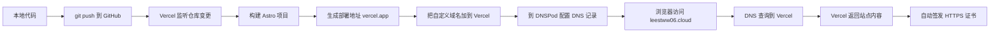
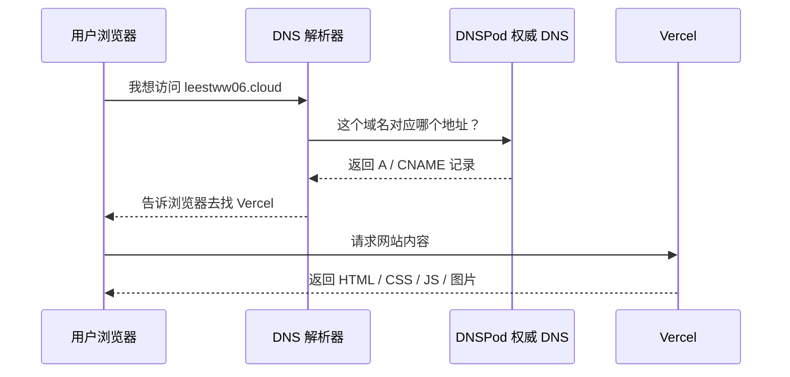
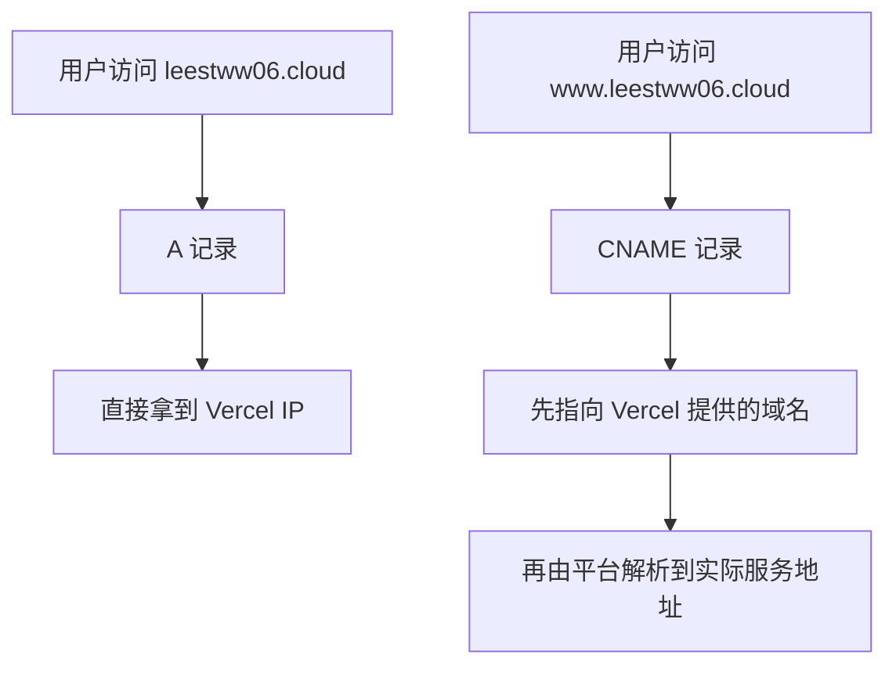
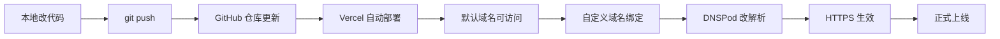

# 网站部署与 DNS 快速入门

这份文档是给“刚把个人站真正上线一次”的自己准备的。

目标不是一次学完所有网络知识，而是先建立一个足够清晰的地图，让你知道：

- 代码放在哪里
- 网站是谁在运行
- 域名为什么能打开网站
- DNS 到底在改什么
- HTTPS 为什么会自动出现
- Vercel、GitHub、DNSPod 分别负责什么

---

## 1. 先用一句话理解整个流程

可以把网站上线想成“开一家店”：

- `GitHub` 像仓库，存放你的源码
- `Vercel` 像装修好并负责营业的商场柜台
- `域名` 像门店招牌名
- `DNS` 像城市里的导航系统，告诉顾客“这个招牌该去哪里找”
- `HTTPS/SSL` 像门店的防伪标识和加密通道，告诉顾客“这家店是真的，而且传输是安全的”

---

## 2. 你这次上线到底发生了什么



这条链路里最容易混淆的是：

- `部署` 不等于 `买域名`
- `域名` 不等于 `DNS`
- `GitHub` 不等于 `Vercel`

---

## 3. 用你的项目举例

你这次的真实角色分工是这样的：

| 组件 | 你在用什么 | 它负责什么 |
| --- | --- | --- |
| 代码仓库 | `GitHub` | 保存源码、版本历史、触发部署 |
| 部署平台 | `Vercel` | 拉取仓库、构建 Astro、对外提供网站 |
| 域名注册 | 腾讯云 | 你拥有 `leestww06.cloud` 这个名字 |
| DNS 托管 | `DNSPod` | 保存这个域名的解析记录 |
| 站点框架 | `Astro` | 生成静态页面 |

所以真正的访问路径不是“浏览器直接打开 GitHub”，而是：



---

## 4. 关键术语，先掌握这些就够了

### 4.1 域名（Domain Name）

例如：

- `leestww06.cloud`
- `github.com`

它是给人看的地址，不是机器真正工作的地址。

机器真正连接时更关心的是 `IP 地址`。

### 4.2 DNS

DNS 的工作就是：

> 把“人能记住的域名”翻译成“机器能连接的地址”

如果没有 DNS，你访问网站时就得记 IP。

### 4.3 NS 记录

它决定：

> 这个域名到底由哪一家 DNS 服务商负责解释

你之前查到的：

- `sunflower.dnspod.net`
- `waxberry.dnspod.net`

说明 `leestww06.cloud` 的权威 DNS 是 `DNSPod`。

这也解释了为什么“要去 DNSPod 改记录”，而不是去别处改。

### 4.4 A 记录

`A` 记录把域名指向一个 IPv4 地址。

例如：

```text
@ -> 216.198.79.1
```

这里的 `@` 代表根域名，也就是：

```text
leestww06.cloud
```

### 4.5 CNAME 记录

`CNAME` 不是直接给 IP，而是说：

> 这个名字请继续跟着另一个域名走

典型用法：

```text
www -> cname.vercel-dns-0.com
```

它常用于子域名，比如：

- `www`
- `blog`
- `api`

### 4.6 TTL

TTL 可以理解为：

> 这条 DNS 记录允许缓存多久

所以你改完 DNS 后，不一定立刻全球生效。等几分钟到几小时都正常。

### 4.7 HTTPS / SSL / TLS

先记住最实用的关系：

- `HTTPS` 是安全版的 `HTTP`
- `TLS` 是实际负责加密的现代协议
- `SSL` 是旧叫法，但今天很多平台和页面还会继续写 `SSL`

你看到的“小锁”本质上是：

> 浏览器确认这个网站身份可信，并且通信内容被加密了

### 4.8 CDN

CDN 可以理解成：

> 把网站内容放到离用户更近的节点上，让访问更快

Vercel 本身就带有边缘网络和全球分发能力，所以你没有单独配置 CDN，也已经享受到了部分 CDN 的效果。

---

## 5. 为什么根域名常用 A，www 常用 CNAME

这是初学者最容易卡住的点之一。

### 常见配置

```text
@    -> A      -> 216.198.79.1
www  -> CNAME  -> cname.vercel-dns-0.com
```

### 原因

根域名 `@`：

- 代表 `leestww06.cloud`
- 很多 DNS 提供商和平台对根域名使用 `A` 记录支持最好

`www`：

- 是子域名
- 用 `CNAME` 指到平台域名更灵活
- 将来平台底层 IP 变了，不需要你再手动改 IP

### 一张图看懂



---

## 6. 为什么 Vercel 会给你一个 `vercel.app` 域名

因为部署平台需要先给你一个“平台默认地址”，方便做到：

- 不买域名也能预览
- 每次部署后都有可访问入口
- 自定义域名还没配好时，网站也能先跑起来

例如：

```text
personal-site-nine-pi.vercel.app
```

它的作用更像是：

> “平台默认门牌号”

而你的 `leestww06.cloud` 是：

> “你自己的正式门牌号”

---

## 7. 为什么你会遇到 `Invalid Configuration`

你这次踩到的是一个非常典型的问题。

### 现象

Vercel 已经知道你想绑定：

```text
leestww06.cloud
```

但它检查公网 DNS 时发现：

- 根域名没有正确的 `A` 记录
- `www` 也还没有正确解析

所以它只能判定：

> 域名还没有真正指到我这里

### 本质原因

不是网站没部署成功，而是：

> “招牌名已经写好了，但城市导航系统还不知道这家店在哪里”

### 修复方式

到 DNSPod 添加或修正：

```text
A      @      216.198.79.1
CNAME  www    cname.vercel-dns-0.com
```

然后等待 DNS 生效，再回 Vercel 点 `Refresh`。

---

## 8. 为什么会自动出现 HTTPS

当域名正确指向 Vercel 之后，Vercel 通常会自动做两件事：

1. 验证这个域名确实已经指向它
2. 自动为这个域名申请并配置证书

于是浏览器后面就能用：

```text
https://leestww06.cloud
```

这也是为什么：

- DNS 没配对时，HTTPS 也常常不会立刻就绪
- 域名刚生效时，证书可能还要再等一会儿

---

## 9. 现在你真正需要会的，不是全部网络知识，而是这个最小闭环

你只要先掌握这条闭环，后面很多东西都会顺很多：



如果这条链路你能讲明白，你已经比“只会点按钮但不知道发生了什么”前进很多了。

---

## 10. 典型错误与排查顺序

### 10.1 `git push` 被拒绝

如果提示：

```text
fetch first
```

通常说明：

- 远端分支先有提交
- 本地和远端历史不一致

你这次就是这种情况。

### 10.2 Vercel 显示 `Invalid Configuration`

优先检查：

1. 是否在正确的 DNS 服务商那里改记录
2. `A` / `CNAME` 的值是否和 Vercel 页面一致
3. 是否存在旧记录冲突
4. 是否只是还没传播完成

### 10.3 能打开 `vercel.app`，但打不开自定义域名

这几乎总是 DNS 问题，不是构建问题。

### 10.4 自定义域名能打开，但 `www` 不行

通常是：

- 少了 `www` 记录
- 或 Vercel 里根本没把 `www` 加入项目

### 10.5 DNS 明明改了，还是没好

可能是：

- 本地 DNS 缓存
- 运营商 DNS 缓存
- TTL 还没过

这时最有效的做法不是乱改，而是：

- 查公网 DNS 当前真实值
- 看它和 Vercel 要求值是否一致

---

## 11. 给小白的阅读顺序

下面这些链接我专门按“先快建立地图，再补概念，再看平台细节”的顺序筛了一遍。

### 第一层：10 分钟先知道整个 Web 是怎么运转的

1. MDN: How the web works  
   适合先建立“浏览器、服务器、HTTP、DNS”全局地图。  
   <https://developer.mozilla.org/en-US/docs/Learn/Getting_started_with_the_web/How_the_Web_works>

2. Cloudflare: 什么是域名？  
   适合把“域名”和“URL”这两个常被混淆的概念拆开。  
   <https://www.cloudflare.com/zh-cn/learning/dns/glossary/what-is-a-domain-name/>

### 第二层：15 分钟补齐 DNS 最小知识

3. Cloudflare: 什么是 DNS？  
   适合知道 DNS 在整个访问链路里的位置。  
   <https://www.cloudflare.com/zh-cn/learning/dns/what-is-dns/>

4. Cloudflare: 什么是 DNS 记录？  
   适合快速理解 `A`、`CNAME`、`TXT`、`NS` 等常见记录。  
   <https://www.cloudflare.com/zh-cn/learning/dns/dns-records/>

### 第三层：理解网站为什么会“更快、更安全”

5. Cloudflare: 什么是 CDN？  
   适合理解为什么部署平台常常顺带提供全球加速。  
   <https://www.cloudflare.com/zh-cn/learning/cdn/what-is-a-cdn/>

6. Cloudflare: Why use HTTPS?  
   适合理解为什么上线后一定要用 HTTPS。  
   <https://www.cloudflare.com/learning/ssl/why-use-https/>

7. Cloudflare: What happens in a TLS handshake?  
   当你已经接受 HTTPS 必须用，再继续理解“加密连接是怎么建立的”。  
   <https://www.cloudflare.com/en-ca/learning/ssl/what-happens-in-a-tls-handshake/>

### 第四层：回到你正在使用的平台

8. Vercel: Adding & Configuring a Custom Domain  
   适合和你这次的真实操作一一对照。  
   <https://vercel.com/docs/concepts/projects/domains/add-a-domain>

9. Vercel: Troubleshooting domains  
   适合遇到 `Invalid Configuration`、记录冲突、验证失败时查。  
   <https://vercel.com/docs/projects/domains/troubleshooting>

---

## 12. 给你的 30 分钟入门路线

如果你现在只想“迅速入门”，建议按这个顺序读：

### 第 1 轮：10 分钟

- 读 MDN `How the web works`
- 目标：知道浏览器访问网站时，背后会发生请求与响应

### 第 2 轮：10 分钟

- 读 Cloudflare `什么是域名`
- 读 Cloudflare `什么是 DNS`
- 目标：知道域名只是名字，DNS 才负责找到地址

### 第 3 轮：10 分钟

- 读 Cloudflare `DNS 记录`
- 读 Vercel `Adding & Configuring a Custom Domain`
- 目标：知道这次自己到底改了哪些记录、为什么这么改

---

## 13. 现阶段你可以先忽略的内容

为了避免一开始被细节淹没，这些先知道名字即可，不用现在深挖：

- 递归查询 vs 迭代查询
- DNSSEC
- AAAA / IPv6
- HSTS
- 多区域 DNS
- 负载均衡
- 反向代理细节

它们当然重要，但不是你当前“把个人站稳稳上线”这件事的主要矛盾。

---

## 14. 你现在应该能说清楚的五句话

如果下面五句话你能自己讲出来，说明你已经入门了：

1. 我的代码托管在 GitHub，但真正运行网站的是 Vercel。
2. 域名只是名字，DNS 负责把名字解析到网站所在的位置。
3. 根域名和 `www` 往往要分别配置记录。
4. `Invalid Configuration` 大多数时候不是代码错，而是 DNS 没配对。
5. HTTPS 的出现依赖域名正确指向平台，平台再为我自动签证书。

---

## 15. 一句话总结

网站上线这件事，本质上不是“把代码传上去”这么简单，而是同时打通四件事：

> **代码仓库、部署平台、域名、DNS 解析**

而你这次已经亲手把这四件事连起来了。

